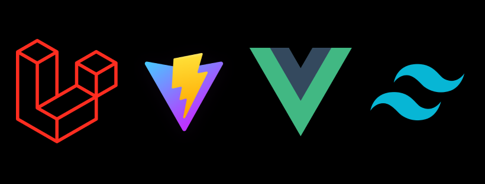

# Laravel9 Vue3 TailwindCSS Starter with Vite



The Laravel9 Vue3 TailwindCSS Starter with Vite is a development environment template that provides a quickstart setup for Laravel 9 with Vue 3 and Tailwind CSS. It offers a streamlined architecture for both the backend and frontend, allowing developers to begin their projects more efficiently.

## Features

- **Backend and Frontend Folder Architecture**: The project follows a folder structure that separates the backend and frontend code. This allows developers to focus on their specific areas of expertise and promotes a clean separation of concerns.

- **Laravel 9**: The latest version of Laravel 9 provides a robust and feature-rich PHP framework for building web applications. It includes various enhancements and improvements over previous versions.

- **Vite as the Build Tool**: The project utilizes Vite as the frontend build tool, enabling faster development and a more efficient development experience. Vite leverages native ES modules to provide rapid hot module replacement (HMR) and optimized production builds.

- **Vue 3**: Vue 3, a progressive JavaScript framework, is integrated into the project, providing a powerful and intuitive frontend development experience. It enables developers to create dynamic and reactive user interfaces.

- **TailwindCSS**: The project leverages TailwindCSS, a utility-first CSS framework, to streamline the styling process. It offers a comprehensive set of pre-defined utility classes that facilitate rapid UI development.

## How It's Made

The Laravel 9 Vue 3 TailwindCSS Starter project is built using the following technologies:

- **Laravel 9**: Laravel 9 serves as the foundation of the project, providing a robust PHP framework for building web applications. It offers features such as routing, database integration, authentication, and more.

- **Vue 3**: Vue 3 is integrated into the project, enabling developers to build dynamic user interfaces with ease. It provides reactivity, component-based architecture, and a rich ecosystem of tools and libraries.

- **TailwindCSS**: TailwindCSS is utilized for styling and UI development. It offers a comprehensive set of utility classes that can be easily applied to create custom and responsive designs.

- **Vite**: Vite is a next-generation frontend build tool that offers lightning-fast development experience. It provides near-instantaneous hot module replacement (HMR), efficient bundling, and optimized production builds.

## Lessons Learned

During the development of the Laravel 9 Vue 3 TailwindCSS Starter project, the following lessons were learned:

- **Integration of Vue and TailwindCSS in Laravel**: Implementing Vue and TailwindCSS within a Laravel project involves configuring build processes, setting up dependencies, and understanding the integration points between the frontend and backend components.

- **Folder Architecture for Separation of Concerns**: Adopting a folder structure that separates the backend and frontend code provides a clear distinction between server-side and client-side logic. This improves maintainability and allows developers to work on their respective areas more efficiently.

- **Managing Dependencies and Build Processes**: Incorporating frontend frameworks and libraries requires managing dependencies and build processes effectively. This includes using package managers like npm, configuring asset compilation, and optimizing development and production workflows.

## Usage

To use the Laravel 9 Vue 3 TailwindCSS Starter template, follow these steps:

1. Clone or download the project repository from GitHub.

   ```bash
   git clone https://github.com/gregrossdev/laravel9-vue3-tailwind-starter.git
   ```

2. Install the project dependencies by running the following command within the project directory:

   ```bash
   composer install
   npm install
   ```

3. Configure the environment variables by creating a copy of the `.env.example` file and renaming it to `.env`. Update the necessary variables such as database configuration.

4. Generate an application key by running the following command:

   ```bash
   php artisan key:generate
   ```

5. Compile the frontend assets by running the following command:

   ```bash
   npm run dev
   ```

6. Start the local development server:

   ```bash
   php artisan serve
   ```
